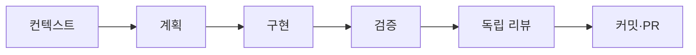

# 그래프 기반 작업 사이클

> **MVP 기능 구현 예외:** `AGENTS.md`의 MVP 기능 구현 간소화 규칙이 적용되는 동안에는 이 사이클과 독립 리뷰 노드를 기록하지 않는다. Jest·lint·타입 검사·빌드·Playwright E2E도 실행하지 않으며, 구현 완료 후 사용자가 직접 화면을 확인한다.

작업 사이클은 에이전트의 체크리스트가 아니라 선행 조건을 가진 방향 그래프다. 상태 파일은 로컬 `.work-cycles/`에만 두며, 작업의 실제 근거는 계획·테스트 결과·리뷰·PR에 남긴다.



## 사이클을 도는 작업

| 작업 성격                                    | 사이클             |
| -------------------------------------------- | ------------------ |
| 문서 (제품 문서·작업 규칙·README)            | 불필요             |
| 에이전트 개발 (역할 문서·하네스·훅·스크립트) | 불필요             |
| **기능 구현** (엔진·검증 로직·데이터 계층)   | **필수 — 한 바퀴** |
| **화면 구현** (페이지·컴포넌트)              | **필수 — 한 바퀴** |

이 그래프는 갈래가 없는 단일 경로다. 두 줄짜리 문서 수정에 6개 노드를 지나게 하면 사이클은 형식이 되고, 형식이 된 사이클은 작업을 끝낸 뒤 한 번에 채워진다. 실제로 지난 사이클 10건의 `context`·`plan`·`implement` 완료 시각을 대조한 결과 3건이 같은 초에 찍혀 있었고, 그 3건은 모두 문서 작업이었다. 사후 배치 기록은 누가 돌렸는지가 아니라 작업이 사이클에 비해 작았을 때 발생했다. 사이클의 대상을 사용자에게 보이는 동작을 바꾸는 작업으로 좁히는 것이, 남은 사이클이 게이트로 작동하게 하는 조건이다.

### 경계가 애매한 작업의 판정

판정 기준은 **이 변경이 실패했을 때 사용자에게 보이는 동작이 달라지는가**다. 달라지면 기능·화면 구현으로 보고 사이클을 돈다.

- **문서 변경에 딸린 코드 주석·타입 주석**: 사이클 불필요. 런타임 동작이 없다.
- **설정 파일 변경**: 빌드·배포·의존성 설정처럼 앱이 동작하는 방식을 바꾸면 사이클을 돈다. lint 규칙, 에디터 설정, 스크립트 추가처럼 개발 도구에 머무르면 불필요하다.
- **테스트만 추가하는 작업**: 사이클 불필요. 다만 테스트를 추가하다 제품 코드를 고치게 되면 그 시점부터 기능 구현이므로 사이클을 시작한다.
- **애매하면 돈다.** 사이클을 한 바퀴 더 도는 비용은 작고, 게이트 없이 병합된 기능 변경을 되돌리는 비용은 크다.

### 사이클 면제는 검증 면제가 아니다

사이클을 돌지 않는 작업에도 다음은 그대로 적용된다.

- `npm run verify` 통과
- 코드·설정·의존성을 변경했다면 구현과 분리된 reviewer agent의 독립 리뷰 판단
- 한글 커밋과 PR 기록

면제되는 것은 노드 기록뿐이다.

## 명령

```bash
npm run cycle -- graph
npm run cycle -- start recommendation-input-validation
npm run cycle -- advance recommendation-input-validation context --evidence "PRD와 F-REC-001 확인"
npm run cycle -- advance recommendation-input-validation plan --evidence "구현 계획과 검증 항목 작성"
npm run cycle -- advance recommendation-input-validation implement --evidence "실패 테스트부터 구현 완료"
npm run cycle -- verify recommendation-input-validation --e2e
npm run cycle -- advance recommendation-input-validation review --evidence "reviewer agent 보고서 링크"
npm run cycle -- advance recommendation-input-validation handoff --evidence "한글 커밋과 PR 링크"
# 재작업이 필요하면 해당 단계와 모든 후속 게이트를 다시 연다.
npm run cycle -- reopen recommendation-input-validation implement --evidence "리뷰 지적 반영"
```

작업 ID는 저장소·셸 호환성을 위해 영문 소문자 케밥 표기만 쓴다. 이 명령은 `main`에서 시작할 수 없고, 선행 노드가 완료되지 않으면 다음 노드를 완료 처리하지 않는다.

동일한 ID를 다시 시작하거나 다른 브랜치에서 상태를 진행할 수 없다. 재작업은 `reopen`으로 시작 노드와 모든 후속 노드를 `pending`으로 되돌린 뒤, 검증과 독립 리뷰를 다시 거쳐야 한다. Playwright 브라우저는 최초 한 번 `npm run setup:e2e`로 설치한다.

## 단계를 밟은 사람이 사이클을 돌린다

지금까지 사이클은 작업을 한 에이전트가 아니라 보고를 받은 감독자가 돌린 경우가 있었다. 그러면 `--evidence`는 그 단계를 밟은 사람이 아니라 보고를 읽은 사람이 쓴 요약이 되고, 사이클은 진행을 막지 못하고 결과만 기록한다.

- **각 단계를 끝낸 사람이 그 자리에서 `advance`한다.** 다른 사람이 대신 돌리지 않는다.
- `--evidence`는 **그 단계에서 실제로 확인한 것**을 쓴다. 보고를 옮겨 적는 것이 아니다.
- 여러 노드를 한 번에 채우지 않는다. 다음 노드로 넘어가기 전에 그 노드의 일을 실제로 끝낸다.
- **격리 워크트리에서 실행되는 작업에는 사이클을 맡기지 않는다.** `.work-cycles/`는 gitignore 대상이고 워크트리를 지울 때 상태 파일이 함께 사라진다. 그러면 `reopen`이 불가능해지고, 에이전트가 사이클을 새로 시작해 기록이 실제 이력과 어긋난다. 사이클이 필요한 기능·화면 구현은 저장소 워크트리에서 진행한다.

### 건너뛴 사이클을 사후에 채우지 않는다

기능·화면 구현에서 사이클을 돌지 못했다면, **작업이 끝난 뒤에 노드를 채우지 않는다.** 빈칸으로 두고 건너뛴 사실을 커밋 메시지 또는 PR 본문에 남긴다.

채워진 기록과 실제로 지킨 기록을 구분할 수 없게 되면 점검 자체가 무의미해진다. 지금 둘을 구분할 수 있는 단서는 `completedAt` 시각뿐이고, 그건 사후 추론이다. 사후 기록은 지켰다는 외양만 만들고 게이트로서의 값은 남기지 않는다.

이 규칙이 지켜지면 아래 점검 항목 1번은 **위반을 찾는 수단이 아니라 정상 기록을 확인하는 수단**이 된다. 건너뜀이 정직하게 남으면 시각을 의심할 이유가 줄어든다.

## 노드의 근거

| 노드        | 완료 근거                                            |
| ----------- | ---------------------------------------------------- |
| `context`   | 관련 PRD·결정·기능 명세·현재 코드 확인               |
| `plan`      | 기능 ID, 파일 범위, 위험, 검증 방법을 포함한 계획    |
| `implement` | 실패 테스트부터 시작한 구현·리팩터링 결과            |
| `verify`    | `npm run verify`, 필요 시 `npm run test:e2e` 성공    |
| `review`    | 분리된 reviewer agent의 보고서 또는 확인된 지적 반영 |
| `handoff`   | 한글 커밋, PR 설명·검증 결과·남은 위험               |

그래프는 인간의 제품 판단이나 독립 리뷰를 자동 승인하지 않는다. 대신 누락되기 쉬운 게이트와 근거를 추적해, 다음에 가능한 작업만 명확히 한다.

## 사이클이 지켜졌는지 점검하는 방법

기능·화면 구현이 완료되면 상태 파일(`.work-cycles/<작업-id>.json`)로 다음을 확인한다.

1. **노드 완료 시각이 서로 다른가.** 각 노드의 `completedAt`을 본다. `context`·`plan`·`implement`가 같은 초에 찍혀 있으면 작업을 다 끝낸 뒤 `advance`를 연달아 돌린 사후 배치 기록이다. 가장 확실한 지표다.
2. **`--evidence`가 그 단계에서 확인한 내용인가.** 사후 요약이나 완료 보고의 재인용이 아닌지 본다.
3. **`review` 완료가 PR 생성보다 먼저인가.** `review`가 `pending`인 채 PR을 만들고 노드를 나중에 채운 사례가 있다.
4. **`reopen` 기록이 있으면** 사이클이 실제로 돌아 재작업을 유발했다는 증거다.

## 사이클이 막지 못하는 것

사이클 CLI는 **자기 명령의 순서만 검사한다.** commit·push·PR 생성은 사이클 상태와 무관하게 실행된다. `review`가 `pending`이어도 PR을 열 수 있고, 어떤 노드도 완료하지 않은 채 병합까지 갈 수 있다.

이 한계는 이번에 고치지 않는다. git 훅으로 강제하면 병렬 작업에서 마찰이 커지고 우회 유인이 생긴다. 따라서 **commit·push·PR이 사이클 뒤에 오는 순서는 사람과 에이전트의 규율에 달려 있다.** 위의 점검 항목이 그 규율을 사후에 확인하는 유일한 수단이다.

## 완료된 사이클의 상태 파일 정리

작업 브랜치가 `main`에 병합되면 그 작업의 상태 파일을 `.work-cycles/`에서 삭제한다. 병합 시점에 정리하지 않으면 완료 여부를 알 수 없는 고아 상태 파일이 쌓이고, 그 안의 `pending` 노드가 미완료 작업처럼 보인다. `.work-cycles/`는 gitignore 대상이라 삭제는 커밋에 영향을 주지 않는다.
