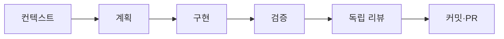

# 그래프 기반 작업 사이클

작업 사이클은 에이전트의 체크리스트가 아니라 선행 조건을 가진 방향 그래프다. 상태 파일은 로컬 `.work-cycles/`에만 두며, 작업의 실제 근거는 계획·테스트 결과·리뷰·PR에 남긴다.



## 명령

```bash
npm run cycle -- graph
npm run cycle -- start recommendation-input-validation
npm run cycle -- advance recommendation-input-validation context --evidence "PRD와 F-REC-001 확인"
npm run cycle -- advance recommendation-input-validation plan --evidence "구현 계획과 검증 항목 작성"
npm run cycle -- advance recommendation-input-validation implement --evidence "실패 테스트부터 구현 완료"
npm run cycle -- verify recommendation-input-validation --e2e
npm run cycle -- advance recommendation-input-validation review --evidence "reviewer agent 보고서 링크"
npm run cycle -- advance recommendation-input-validation handoff --evidence "한글 커밋과 PR 링크"
# 재작업이 필요하면 해당 단계와 모든 후속 게이트를 다시 연다.
npm run cycle -- reopen recommendation-input-validation implement --evidence "리뷰 지적 반영"
```

작업 ID는 저장소·셸 호환성을 위해 영문 소문자 케밥 표기만 쓴다. 이 명령은 `main`에서 시작할 수 없고, 선행 노드가 완료되지 않으면 다음 노드를 완료 처리하지 않는다.

동일한 ID를 다시 시작하거나 다른 브랜치에서 상태를 진행할 수 없다. 재작업은 `reopen`으로 시작 노드와 모든 후속 노드를 `pending`으로 되돌린 뒤, 검증과 독립 리뷰를 다시 거쳐야 한다. Playwright 브라우저는 최초 한 번 `npm run setup:e2e`로 설치한다.

## 노드의 근거

| 노드 | 완료 근거 |
| --- | --- |
| `context` | 관련 PRD·결정·기능 명세·현재 코드 확인 |
| `plan` | 기능 ID, 파일 범위, 위험, 검증 방법을 포함한 계획 |
| `implement` | 실패 테스트부터 시작한 구현·리팩터링 결과 |
| `verify` | `npm run verify`, 필요 시 `npm run test:e2e` 성공 |
| `review` | 분리된 reviewer agent의 보고서 또는 확인된 지적 반영 |
| `handoff` | 한글 커밋, PR 설명·검증 결과·남은 위험 |

그래프는 인간의 제품 판단이나 독립 리뷰를 자동 승인하지 않는다. 대신 누락되기 쉬운 게이트와 근거를 추적해, 다음에 가능한 작업만 명확히 한다.
